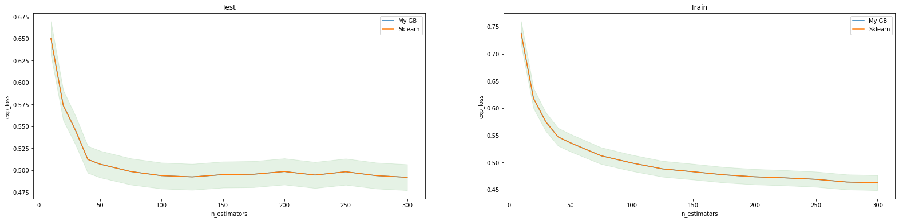
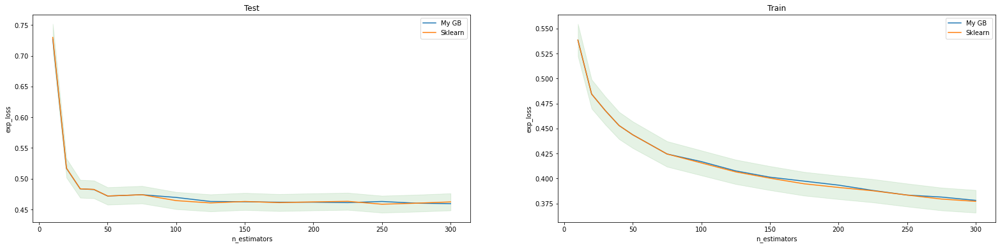
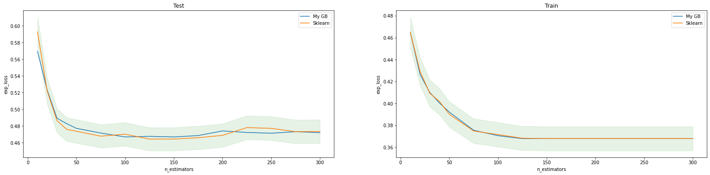

# GradientBoosting with AdaLoss
## Выполнено:
- Реализация дерева решений для решения задачи регрессии.
- Реализация градиентного бустинга над этими деревьями.
- Уточнение значений в листьях при помощи гессиана. 
- Сравнение качества классификации для бустингов над деревьями глубины 1, 3, 5 c алгоритмом GradientBoostingClassifier из библиотеки sklearn.
## Графики logloss.
(Зеленым помечен 3% интервал от logloss sklearn модели)
- Для depth=1

- Для depth=3

- Для depth=5
